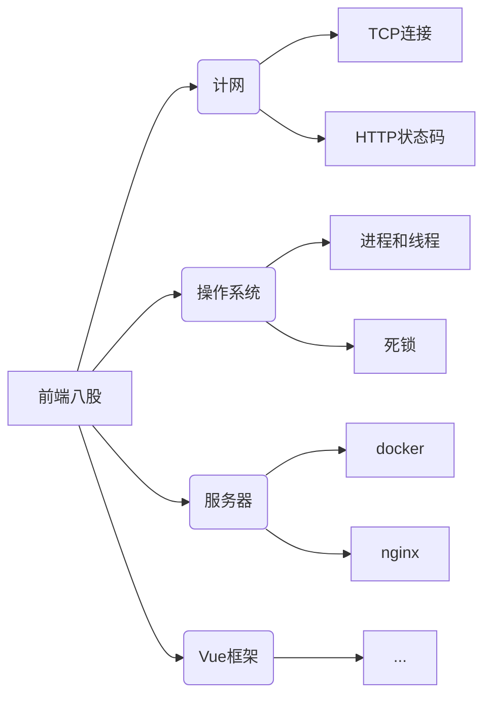

# 前言

日志，各位看官就当乐子看吧。

**正经人谁写日记啊？！！**    ——鹅城县长

今天没背八股文，刷练习题，还做了德科的机试，三道题都没有完全通过所有用例，都是暴力解答，但是感觉思路没问题，估计是有些情况没考虑到。

# 华为机试练习题

## HJ18 IP地址和掩码并进行分类统计

请解析IP地址和对应的掩码，进行分类识别。要求按照A/B/C/D/E类地址归类，不合法的地址和掩码单独归类。

所有的IP地址划分为 A,B,C,D,E五类

A类地址从1.0.0.0到126.255.255.255;

B类地址从128.0.0.0到191.255.255.255;

C类地址从192.0.0.0到223.255.255.255;

D类地址从224.0.0.0到239.255.255.255；

E类地址从240.0.0.0到255.255.255.255

私网IP范围是：

从10.0.0.0到10.255.255.255

从172.16.0.0到172.31.255.255

从192.168.0.0到192.168.255.255

子网掩码为二进制下前面是连续的1，然后全是0。（例如：255.255.255.32就是一个非法的掩码）

（注意二进制下全是1或者全是0均为非法子网掩码）

注意：

1. 类似于【0.*.*.*】和【127.*.*.*】的IP地址不属于上述输入的任意一类，也不属于不合法ip地址，计数时请忽略

2. 私有IP地址和A,B,C,D,E类地址是不冲突的

### 思路

IP合法性判断用多条件暴力判断（代码会看起来有些长），卡到我的是**掩码判断**：首先如何判断前面全是1和后面全是0的组合，其次还要注意，要求的是整体的二进制，前面是1后面是0，最后就是如何转进制，还得注意**首部补零**（一般第一个想法就是转进制判断，网上也有用正则暴力判断的，不推荐）。掩码判断是学习别人代码的。

```javascript
(num+256).toString(2).substring(1)
```

很巧妙，256的二进制是`100000000` 后八位是零，转为二进制，源数据加在后面八位上，再用`substring` 从第一位置取子串。整体代码如下，

```javascript
const rl = require("readline").createInterface({ input: process.stdin });
var iter = rl[Symbol.asyncIterator]();
const readline = async () => (await iter.next()).value;

void async function () {
    // Write your code here
    let res=[0, 0, 0, 0, 0, 0, 0]
    while(line = await readline()){
        // 不纳入计数的
        if(line[0]==='0'|| line.slice(0,3)==='127') continue;
        let count=check(line)
        Object.keys(count).forEach(i=>res[i]++)
    }
    console.log(res.join(' '))
}()

function check(tokens){
    tokens = line.split('~');
    let a = tokens[0];  // ip
    let b = tokens[1];  // 掩码

    let arr=a.split('.');
    if(arr.length!=4 || !arr[0] || arr[0]<0) return {5:1}
    else if(arr[0]<127){
        // A类
        for(let i=1;i<4;i++){
            if (arr[i]!='' && arr[i]<256 && arr[i]>=0) continue;
            return {5:1}
        }
        let isTrueMask=checkSub(b);
        if(isTrueMask){
            if(arr[0]==10){
                // 私有
                return {0:1, 6:1}
            }
            return {0:1}
        }else return {5:1}
    }else if(arr[0]<192){
        // B类
        for(let i=1;i<4;i++){
            if (arr[i]!='' && arr[i]<256 && arr[i]>=0) continue;
            return {5:1}
        }
        let isTrueMask=checkSub(b);
        if(isTrueMask){
            if(arr[0]==172 && arr[1]>15 && arr[1]<32){
                // 私有
                return {1:1, 6:1}
            }
            return {1:1}
        }else return {5:1}
    }else if(arr[0]<224){
        // C类
        for(let i=1;i<4;i++){
            if (arr[i]!='' && arr[i]<256 && arr[i]>=0) continue;
            return {5:1}
        }
        let isTrueMask=checkSub(b);
        if(isTrueMask){
            if(arr[0]==192 && arr[1]==168){
                // 私有
                return {2:1, 6:1}
            }
            return {2:1}
        }else return {5:1}
    }else if(arr[0]<240){
        // D类
        for(let i=1;i<4;i++){
            if (arr[i]!='' && arr[i]<256 && arr[i]>=0) continue;
            return {5:1}
        }
        let isTrueMask=checkSub(b);
        if(isTrueMask) return {3:1}
        else return {5:1}
    }else if(arr[0]<256){
        // E类
        for(let i=1;i<4;i++){
            if (arr[i]!='' && arr[i]<256 && arr[i]>=0) continue;
            return {5:1}
        }
        let isTrueMask=checkSub(b);
        if(isTrueMask) return {4:1}
        else return {5:1}
    } else {
        return {5:1}
    }
}

function checkSub(str){
    let arr=str.split('.')
    if(arr.length!=4 || !arr[0] || arr[0]<0) return false
    let mask=''
    for(let i=0;i<arr.length;i++){
        mask+=toBinary(parseInt(arr[i]))
    }
    if(mask.indexOf('01')!=-1 || mask.indexOf('10')==-1) return false
    return true;
}
function toBinary(num){
    return (num+256).toString(2).substring(1)
}
```

# 正式机试

## 填补合并不连续区间

给了一个由多组区间`[a1,b1], [a2,b2], ...[an,bn]`组成的数据和一个连接器`[x1, x2, ...xm]`，现在要求是用连接器中的值将区间之间的间隙填补上，使得这组区间尽可能合并起来。输出合并后，区间的个数。一个间隙只能用一个连接器组成的填补。

```javascript
输入：
// 区间
[1,10],[15,20],[18,30],[33,40]
// 连接器
[5,4,3,2,1]
输出：
1
```

`[1,10]`和`[15, 20]`之间不连续，用`5`将其填充，就能合并成`[1，20]`的区间，同理`[18,30]`和`[33, 40]`之间就可以用`3`填充。`[15,20]`和`[18, 30]`之间有重叠，能直接合并成一个区间，最终结果等于`1`。

## 字符串A冗余覆盖B

现有两个字符串`s1`，`s2`和一个正整数`k`，要求在s2中找到满足如下条件的子串：

1. 子串长度等于s1.length+k;

2. 子串中包含了s1中出现的所有字母；

3. 子串中的字母出现的次数不少于s1对应字母出现的次数；

字符串中的字母都是小写的。

## 异常打卡

异常考勤信息（死去的回忆在攻击我！！！），一组考勤信息有工号，时间，距离，打卡设备，注册设备，出现以下情况的就是异常：

1. 打卡设备和注册设备不同；

2. 或者，同一人的前后两次打卡记录的时间少于60分钟并且距离大于5km

输出异常打卡信息，如果是第二种情况，前后两条打卡记录都算异常，都要输出。输出顺序按照输入顺序。

这题只通过了百分之十几的用例，不知道哪里不对。

# 彩蛋

给自己制定了一个计划，**三天小总结，9天大总结**。今天是第四篇文章了，小总结前3天的内容。

# 总结

| 标题              | 概述                                                |
| --------------- | ------------------------------------------------- |
| #001#突击服务器和网络通识 | 准备一个软件实施的面试，特地找了**服务器**、**网络**、**操作系统**的题         |
| #002#投简历和刷题     | 软件实施不招了，北京德科约了近期机试，去刷题了，也看了一些**vue**面试题           |
| #003#刷题和华为机试练习  | 刷牛客编程题，本来是打算当天晚上机试，HR没法链接，发的是练习题库（WTF，很贴心），推到了第二天 |

总的来说：

1. 八股文常背常新；

2. 前端岗位现在对跨端方面的要求较多，桌面端（electorn）和移动端（h5 hybrid, 小程序，react native）还有后端（nodeJS），要求知识面广，再者钻研的方向刚好和岗位匹配（好难！！！）。当然大多数还是纯Web开发岗位，但是要求编写组件能力，要对框架有很深的理解（源码级理解起步，可见对编码能力要求很高，对浏览器的理解也要充分）；

3. MDN文档也是常看常新，API上写的有些例子挺巧妙的，对一些API的使用更熟悉，感谢阮一峰老师写的ES6入门，官网文档真不适合学习。

（想用xmind画思维导图的，之后再用吧）



## 编程题

这三天刷的题目全是对字符串、数组的操作（不过，实际工作80%这些够用了）；`?:`；`||`；`&&`；类型的隐式转化（加法，判断条件单纯是个变量，这里有大坑，能理解为什么`typescript` 热度越来越高）；数组的空位、undefined和null对遍历的影响；类型转化和逻辑判断的结合。这里就不重复写代码了，针对遇到的问题，总结一下，这一篇写不完。明天总结一下上面提到的问题，刚好八股文里也有提到。计网、操作系统、服务器、Vue框架的复习总结不写了，一天干不了这么多的活，计划做一个简答的思维导图记忆。
