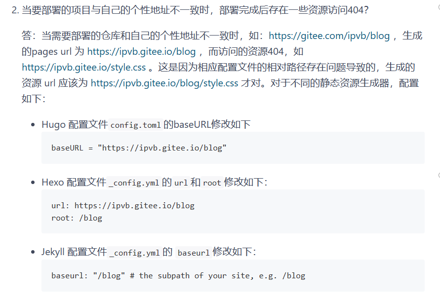
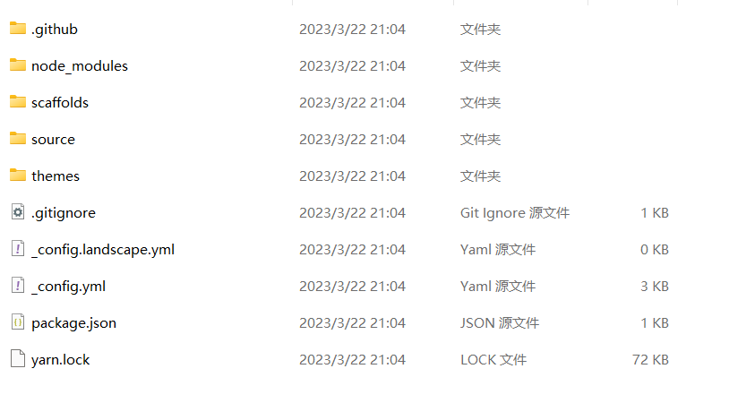
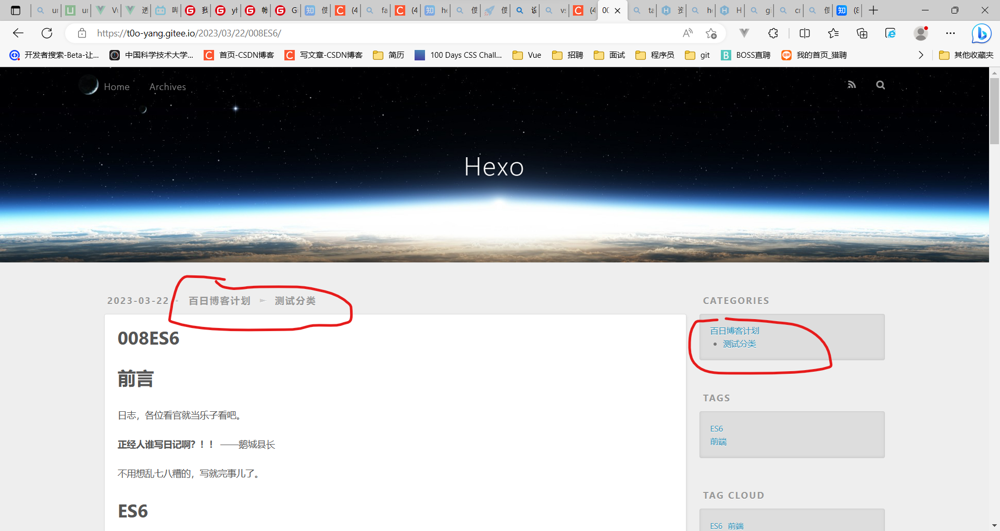

# 前言

日志，各位看官就当乐子看吧。

**正经人谁写日记啊？！！**    ——鹅城县长

今天uniapp的学习进度到了`showModal`，其次是在码云上重新搭了博客。介绍工具、记录一下过程。改用个人博客，也是因为这几天写的只能算日志，不算技术博客，还是放在个人网站上比较好。

## 技术选型

### 静态网站工具

gitee上的Page服务中提到了`Jekyll`、`Hugo`、`Hexo`三种。虽然`Hexo`的部署过程最慢（[官方说的](https://gitee.com/help/articles/4136#article-header0)），但是个人只用过`Hexo`，所以选择了Hexo。

### 服务提供商

`gitee`和`github`两个。gitee码云，国内的服务商，访问会更稳定。但是使用gitee有个缺点，`hexo g -d`没法自动部署，每次都需要上网站更新部署，下面会提到（不知道github会不会有这种情况）。

# gitee+hexo搭建

参考：[使用hexo，如果换了电脑怎么更新博客？ - CrazyMilk的回答 - 知乎](https://www.zhihu.com/question/21193762/answer/79109280)，以前在github上用过Hexo搭建过博客，换设备后，想用这个网站接着写，发现github的仓库中只保留了生成的静态网页，也就是说`hexo`配置过程要重新弄，连接远程仓库，没有原文档，重新部署的话，旧的博客不就没了吗？所以这次重新使用`hexo`格外关注这个的解决方案。不想上传配置文件的，看这篇文章：[使用hexo+gitee搭建博客](https://blog.csdn.net/weixin_45631738/article/details/104716374)
回到文章内容，参考文章是用github的，那我就把gitee的过程写一下。

## 1.准备好远程仓库

创建步骤就不细聊了，跟着页面提示走。注意两个点：
1. 仓库名最好是账号的初始名称（如果改过名，可打开个人主页，头像下方‘@’的一串字符就是名称），如果仍想用别的名字，就需要配置一下样式的路径，否则网页没有样式，显示效果很丑。



2. 设置两个分支`master`和`hexo`，hexo存放网站的原始文件，包括配置等；master存放生成的静态网页。最后将`hexo`设置成默认分支。

## 2.准备本地仓库

克隆远程仓库

## 3.准备hexo

1. 安装，打开`git bash`全局安装hexo：`npm i hexo-cli -g`
2. 初始化，在`项目文件名a`的**外一层**用`hexo init 临时文件名b`初始化一个`hexo`项目。hexo init使用的文件夹**必须是空**，所以先在其它地方初始化，然后复制到本地仓库中。
3. 复制，把`临时文件名a`文件夹中自动生成的所有文件复制到`项目文件名a`文件夹中。生成的文件大致有以下这些。



4. 下载hexo的依赖包，回到本地仓库的目录下，执行`npm i`
> 注意：之后所有操作都在`hexo`分支下。
5. 下载`hexo-deployer-git`，hexo部署到git上的工具包，执行`npm i hexo-deployer-git`。
6. 修改分支为master，`repo`改为自己的远程仓库，`branch`等于`master`。

```bash
# Deployment
## Docs: https://hexo.io/docs/one-command-deployment
deploy:
  type: git
  repo: git@gitee.com:t0o-yang/t0o-yang.git
  branch: master
```

## 4.部署上线

1. 依次执行`git add .`、`git commit -m "..."`、`git push origin hexo`提交网站相关的文件；
2. 执行`hexo g -d`生成网站并部署
> 访问gitee上的博客，发现并没有自动更新，只能到gitee上手动操作。不知道github有没有这种问题

# 如何使用

使用`hexo new 文章名`新建文章，会自动生成md文件。或者，在本地仓库的 `/source/_posts` 目录下直接新建md文件。建议用命令生成。命令生成会根据设定的模板生成内容，如标题、时间等等，不需要自己写了。同时也能直接生成资源文件夹，存放图片等等内容。

## 启用资源文件夹

在`_config.yml`中修改`post_asset_folder`，并添加一些配置。

```xml
post_asset_folder: true # 图像等资源访问
marked: # 启用后，资源图片将会被自动解析为其对应文章的路径，直接用md语法
  prependRoot: true
  postAsset: true
```

在文章中直接用``就可以放置图片了。更多内容，看[官方文档](https://hexo.io/zh-cn/docs/asset-folders).

## 增加标签和分栏

```bash
---
title: 023gitee+hexo搭建个人博客
date: 2023-03-22 23:53:14
tags: [uniapp,hexo]
categories: 百日博客计划
description: 系统学习uniapp第二天，搭建个人博客
---
```

文章开头增加这些代码，其中，`tags`是数组，表示有多个标签；只有一个标签，直接写标签名就行了；categories表示分栏（分类），只有一个值时，表示一个分栏；如果是数组，想`categories: [a, b]`，则表示文章在`a`栏目下的`b`子栏目下，如下。



同属多个栏目的语法，还没找到...