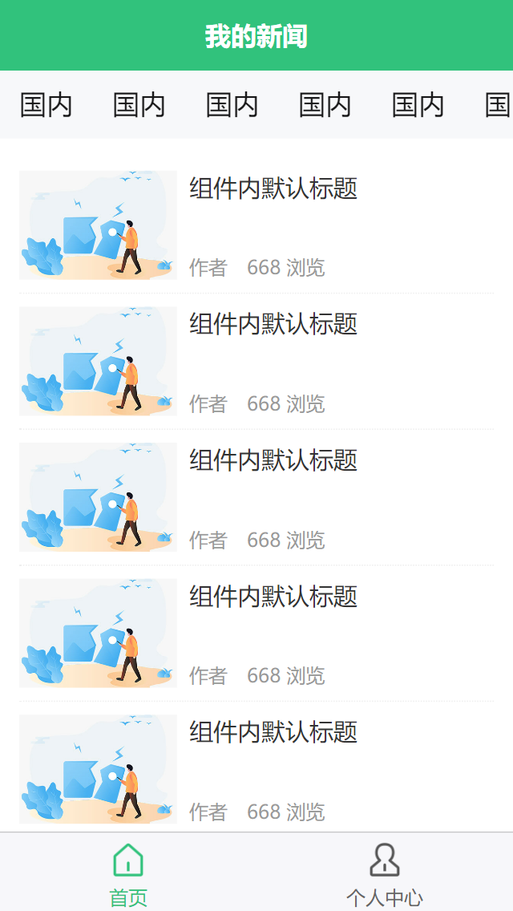

# 前言

系统学习第三天哦，进度到做一个新闻案例，马上结尾了。

# 免费api

获取狗子图片：http://dog.ceo/api/breeds/image/random

获取猫咪图片：http://api.thecatapi.com/v1/images/search?limit=1
`limit`如果不等于1，则会返回10张图片

# 总结

这三天系统学习uniapp，明天就能结束了。我发现网页上的图片无法显示，在本地上是能看到的，怀疑是gitee用的hexo版本太低了，不支持最新的hexo3的引入图片的功能。下面测试一下，先把图片放在gitee的仓库中，能不能正常查看：




