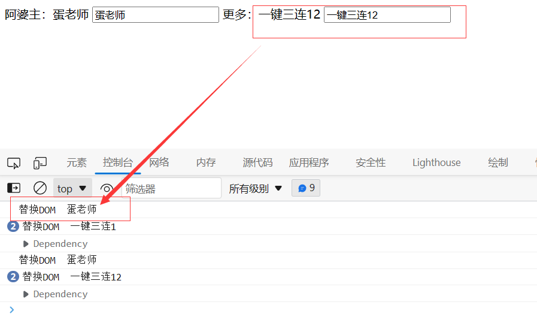

# 前言

实现还存在不足之处：

1. 对嵌套对象，依赖会有重复；

more.like 应该和 name 一样只有两个依赖，但是这里存在四个


2. 目前，对一个状态修改，会造成所有订阅者做 update 操作;

更新 more.like，会通知 name 更新


3. 需要用 Vue.createApp 的形式绑定 this，之后调用 mount，与 Vue3 原版不同

```html
<script>
  const { createApp } = Vue;

  const app = createApp({
    data() {
      return {
        name: "蛋老师",
        more: {
          like: "一键三连",
        },
      };
    },
  });
  app.mount("#app");
</script>
```

#### vue3 数据绑定

html 代码

```html
<html>
  <body>
    <div id="app">
      <span>阿婆主：{{name}}</span>
      <input type="text" v-model="name" />
      <span>更多：{{more.like}}</span>
      <input type="text" v-model="more.like" />
    </div>
  </body>
  <script src="./vue3数据绑定.js"></script>
  <script>
    const { createApp } = Vue;

    const app = Vue.createApp({
      data() {
        return {
          name: "蛋老师",
          more: {
            like: "一键三连",
          },
        };
      },
    });
    app.mount("#app");
  </script>
</html>
```

绑定代码

```js
/**
 * TODO：
 * 1. 对嵌套对象，依赖会有重复；
 * 2. 目前，对一个状态修改，会造成所有订阅者做update操作
 * 3. 需要用 Vue.createApp 的形式绑定this，之后调用mount，与Vue3原版不同
 */

const Vue = {
  $el: "",
  $data: null,
  createApp: function (obj) {
    this.$data = reactive(obj.data());
    return this;
  },
  mount: function (el) {
    Compile(el, this);
  },
};

// 模板解析，替换DOM
function Compile(element, vm) {
  vm.$el = document.querySelector(element);
  const fragment = document.createDocumentFragment();
  let child;
  while ((child = vm.$el.firstChild)) {
    fragment.append(child);
  }
  fragment_compile(fragment);
  // 替换内容
  function fragment_compile(node) {
    // 正则匹配模板语法，如 {{ name }}
    const pattern = /\{\{\s*(\S+)\s*\}\}/;
    if (node.nodeType === 3) {
      const xxx = node.nodeValue;
      let result = pattern.exec(node.nodeValue);
      if (result) {
        const arr = result[1].split(".");
        const value = arr.reduce((total, current) => total[current], vm.$data);
        node.nodeValue = xxx.replace(pattern, value);
        // 创建订阅者
        new Watcher(vm, result[1], (newValue) => {
          console.log("替换DOM ", newValue);
          node.nodeValue = xxx.replace(pattern, newValue);
        });
      }
      return;
    }
    if (node.nodeType === 1 && node.nodeName === "INPUT") {
      const attr = Array.from(node.attributes);
      attr.forEach((i) => {
        if (i.nodeName === "v-model") {
          const value = i.nodeValue
            .split(".")
            .reduce((total, current) => total[current], vm.$data);
          node.value = value;
          new Watcher(vm, i.nodeValue, (newValue) => {
            node.value = newValue;
          });
          node.addEventListener("input", (e) => {
            // ['more','like']
            const arr1 = i.nodeValue.split(".");
            // ['more']
            const arr2 = arr1.slice(0, arr1.length - 1);
            // vm.$data.more
            const final = arr2.reduce(
              (total, current) => total[current],
              vm.$data
            );
            final[arr1[arr1.length - 1]] = e.target.value;
          });
        }
      });
    }
    node.childNodes.forEach((child) => {
      fragment_compile(child);
    });
  }
  // DOM 回填
  vm.$el.appendChild(fragment);
}

// 依赖，收集并通知订阅者
class Dependency {
  constructor() {
    this.subscribers = [];
  }
  // 收集订阅者
  addSub(sub) {
    this.subscribers.push(sub);
  }
  // 通知订阅者
  notify() {
    this.subscribers.forEach((sub) => {
      sub.update();
    });
  }
}

/**
 * 订阅者
 * 做什么：视图变化时，修改数据模型
 * 什么时候创建：模板解析时，就创建
 *
 */
class Watcher {
  constructor(vm, key, callback) {
    this.vm = vm;
    this.key = key;
    this.callback = callback;
    // 临时属性
    Dependency.temp = this;
    // 触发getter，会执行 Proxy.get
    key.split(".").reduce((total, current) => total[current], vm.$data);
    Dependency.temp = null;
  }
  update() {
    const value = this.key
      .split(".")
      .reduce((total, current) => total[current], this.vm.$data);
    this.callback(value);
  }
}

// // 创建依赖
const dependency = new Dependency();
function reactive(data_obj) {
  if (typeof data_obj !== "object" && data_obj != null) return obj;
  // 代理 数据对象
  return new Proxy(data_obj, {
    get: function (target, propKey, receiver) {
      // 订阅者加入依赖实例的数组中
      Dependency.temp && dependency.addSub(Dependency.temp);
      const value = Reflect.get(target, propKey, receiver);
      // console.log(`获取 ${propKey}---${value}`)
      return typeof value === "object" ? reactive(value) : value;
    },
    set: function (target, propKey, value, receiver) {
      // console.log(`设置 ${propKey}---${JSON.stringify(value)}`);
      // // todo: 并没有指定 propKey，会触发所有订阅者
      const rs = Reflect.set(target, propKey, value, receiver);
      dependency.notify();
      console.dir(dependency);
      return rs;
    },
  });
}
```
