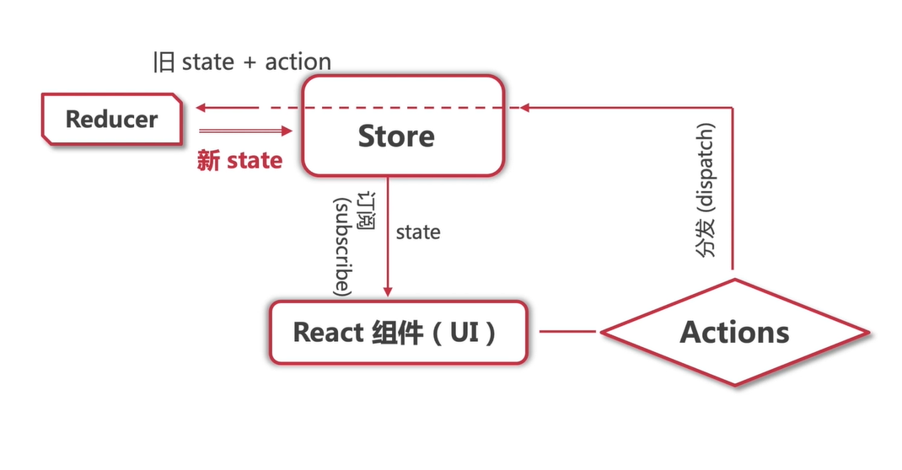

## react router

### 什么是 SPA？

### 什么是路由？什么是虚拟路由？

### 如何在 typescript 项目中配置 react-router?

### 如何进行页面切换？

### 使用 react-router 来处理路由需要满足哪些要求？

### 如何跨组件传递路由数据？withRouter() vs useRouter()

### history.push() vs <Link />?

## redux

### redux 有什么用？

### 如何创建一个具有订阅与推送功能的数据仓库？

### 什么是 store？什么是 action？什么是 reducer？

个人理解就好比 Store 是餐厅的老板，负责统筹全局；Action 则是餐厅服务员，负责招待客户；Reducer 则是餐厅大厨，负责老板吩咐要做的菜品；而组件则是消费者；

### 如何理解 redux 的工作流程？

### i18n 是什么？

国际化，简单说就是网站支持其他语言

### 工厂模式是什么？

### 如何在 redux 中使用 typescript 定义强类型？

### redux 和 react-redux 有什么关系？

### connect() v.s. useDispatch() v.s. useSelector()

## TypeScript

快速入门，不做笔记
