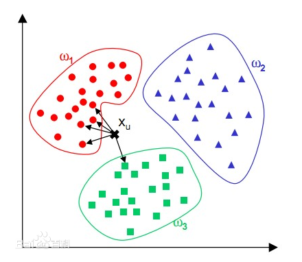
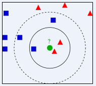

# Python语言重写knn算法

## knn算法介绍

**knn（k-NearestNeighbor），中译：k最近邻分类算法**。算法要完成的事情是：一组已分类数据集，一组待分数据，根据knn算法将待分数据分好类。
明白要做什么，这个过程的分类准则就是knn算法。其**核心**就是，**由近邻数据的类别决定待分数据的类别。**
那么判断是否为近邻又由什么决定呢？——距离，确切来说是，**欧式距离**。空间中有两个点 a(x~0~, y~0~)，b(x~1~, y~1~) ，两点之间的距离就是欧式距离。公式请自查。
放图说话，下图都是表示knn决策过程。





其也能进行回归分析，详细内容请参考**近邻算法_百度百科**，点击[这里][1]。

## 算法步骤及实现

**具体实现参考了近邻算法_百度百科**，下面将算法步骤和算法实现放在一起。

### 数据结构

数据存取方式采用**操作列表**的方式，这里考虑的是熟练度。当然**推荐选择导入 Numpy ，操作效率更高**。

### 算法流程图


### 1.训练集和测试集

先获取训练集数据和测试集数据，实现过程中先采用的训练集和测试集是，自编的简单数据。

```python
myDataset = {'data':[[2, 3, 0, 0], [3, 4, 0, 0], [4, 5, 0, 0], [5, 6, 0, 0]],
             'target':[2, 1, 0, 1]}
X_train, y_train = myDataset['data'], myDataset['target']
X_test = [[1, 2, 0, 0],[0, 0, 0, 0]]
```

具体真正使用的训练集和测试集是，鸢尾花数据集。

```python
iris_dataset = load_iris()
X_train, X_test, y_train, y_test = train_test_split(iris_dataset['data'], iris_dataset['target'], random_state=0)
```

### 2.设定k值

k值，是决定了待测数据 X_test 会有 k 个邻居。

```python
def __init__(self, n_neighbors):
    '''指定近邻个数'''
    self.n_neighbors = n_neighbors # 近邻数
    # self.x_new = [] # 预测数据集
```

### 3.创建预先序列

百科中第四步，**优先级队列**在本文名为：**预先序列** 。预先序列其实就是近邻序列，其大小等于 k ，具体说是，预先序列计算处理得到的距离的预先序列 **distList** 。关于创建预先序列的用途，我的理解是，**当 k > 1时，即待分数据会有 k 个邻居时，在不采用预先序列的情况下，同样的，会产生一个 k 大小的近邻序列，并且在生成序列过程中第 i ( i < k ) 个数据都需要进行判断数据是否需要更新。而采用了预先序列，每次比大小的两方，一个是训练数据集，另一个就会变成 distList 中的最大值，更新最大值即可，会减少判断次数。**
`使用每个数据的ID(索引)建立预先序列`

```python
 self.idList = random.sample(range(0, len(x_train)), self.n_neighbors) # 获取空间大小为k的预先序列,k个随机的元组,k=n_neighbors
```

`计算距离`

```python
def get_deftDist(self, tp):
    '''计算测试数据与预先序列的距离'''
    list = [] # 存放预测数据与预先序列的距离，列表含有k个距离
    '''
    for i in range(len(self.x_new)):
        tp = self.x_new[i]
    '''
    for j in range(len(self.idList)):
        sum = 0
        index = self.idList[j]
        for k in range(len(tp)):
            sum += (tp[k]-self.x_train[index][k])**2 
        sum = math.sqrt(sum)
        list.append(sum)
    return list
```

### 4.更新预先序列

遍历训练集，计算当前训练集数据 X_train~i~ 与待分数据 X_test~j~ 的距离 L ，比较 L 与预先的最大距离 LMax 大小，若大于，直接进入下一训练集数据 X_train~i+1~ ，若小于，将 LMax 对应的序列数据替换成 X_train~i~ 。
**在需要替换时，其实还需要一步判断，在构建预先序列时，K个随机值构成的 idList 可能已经包含了当前训练集数据 X_train_i 的索引值即 i ，所以如果替换元素的话，近邻队列不就出现1或多个重复的元素了吗？，那么分类应该会有误差**。参考百科中的第 6 步，似乎没有考虑到。
`解决上文提到的 “ 判断 ” `

```python
if j not in self.idList:
    index = distList.index(Lmax) # 获取最大预先距离的索引
    self.idList[index] = j # 换为当前训练数据的id
    distList[index] = L # 更新最大预先距离
```

`算法当前步骤所有代码`

```python
distList = self.get_deftDist(tp) # 获取此时测试数据x_new[i]与预先序列的距离
for j in range(len(self.x_train)):
    Lmax = max(distList)
    L = 0
    for k in range(len(self.x_train[j])):
        L += (tp[k]-self.x_train[j][k])**2 # 遍历训练集，计算当前x_new[i]训练集与x_train[j]的距离
    L = math.sqrt(L)
    if L >= Lmax:
        continue # 若当前所得距离大于预先序列距离的最大值，进入下一个训练数据
    else:
        # 更新预先序列中的距离和对应训练数据的id
        if j not in self.idList:
            index = distList.index(Lmax) # 获取最大预先距离的索引
            self.idList[index] = j # 换为当前训练数据的id
            distList[index] = L # 更新最大预先距离
```

### 5.获取测试集所属类

遍历最后的近邻序列，选择出其中多数类，得出测试数据集的所需类。

```python
flag = [0, 0, 0]
    for m in range(len(self.idList)): # 遍历预先序列中，计算其中的多数类，判断测试数据属于哪类
        indI = self.idList[m]
        targetI = self.y_train[indI]
        if targetI == 0:
            flag[0] += 1
        elif targetI == 1:
            flag[1] += 1
        elif targetI == 2:
            flag[2] += 1
        #print(flag)
    #print('测试数据所属类: ', flag.index(max(flag)))
    targetList.append(flag.index(max(flag))) # 返回第一个极大值的索引值
```

### 预测模型的精准度

除了上述knn算法的五个步骤外，还额外添加了计算模型的精确值的方法 score() 。

```python
def score(self, y_pre, y_test):
    '''计算精确值'''
    count = 0
    scoreList = list(map(lambda x: x[0]-x[1], zip(y_pre, y_test)))
    for i in scoreList:
        if i == 0:
            count += 1
    score = count/len(scoreList)
    return score
```

## 完整代码

算法结构是**仿照 KNeighborsClassifier**的使用过程。

```python
knn = KNeighborsClassifier(n_neighbors=31) #设定近邻指标

knn.fit(X_train, y_train)

y_pre = knn.predict(X_test)

score = knn.score(X_test, y_test)
```

| KNeighborsClassifier | MyKNN           | MykNN的方法功能 |
| -------------------- | --------------- | ---------- |
| --init--()           | --init--()      | 设定近邻个数     |
| fit()                | get_trainData() | 获取训练集数据    |
| predict()            | predict()       | 产生预测模型     |
| score()              | score()         | 计算精确度      |

`完整knn代码`

```python
import random
import time
import math

#import numpy as np
from sklearn.datasets import load_iris
from sklearn.model_selection import train_test_split

class MyKNN:

    def __init__(self, n_neighbors):
        '''指定近邻个数'''
        self.n_neighbors = n_neighbors # 近邻数
        # self.x_new = [] # 预测数据集

    def predict(self, x_new):
        '''预测模型, 更新近邻序列和得出测试数据所属类'''
        targetList = [] # 存储预测数据的预测所属类
        for i in range(len(x_new)):
            tp = x_new[i]
            #print(tp)
            distList = self.get_deftDist(tp) # 获取此时测试数据x_new[i]与预先序列的距离
            for j in range(len(self.x_train)):
                Lmax = max(distList)
                L = 0
                for k in range(len(self.x_train[j])):
                    L += (tp[k]-self.x_train[j][k])**2 # 遍历训练集，计算当前x_new[i]训练集与x_train[j]的距离
                L = math.sqrt(L)
                if L >= Lmax:
                    continue # 若当前所得距离大于预先序列距离的最大值，进入下一个训练数据
                else:
                    # 更新预先序列中的距离和对应训练数据的id
                    if j not in self.idList:
                        index = distList.index(Lmax) # 获取最大预先距离的索引
                        self.idList[index] = j # 换为当前训练数据的id
                        distList[index] = L # 更新最大预先距离
                #distList[i].append(L)
        #return sorted(distList)
            flag = [0, 0, 0]
            for m in range(len(self.idList)): # 遍历预先序列中，计算其中的多数类，判断测试数据属于哪类
                indI = self.idList[m]
                targetI = self.y_train[indI]
                if targetI == 0:
                    flag[0] += 1
                elif targetI == 1:
                    flag[1] += 1
                elif targetI == 2:
                    flag[2] += 1
                #print(flag)
            #print('测试数据所属类: ', flag.index(max(flag)))
            targetList.append(flag.index(max(flag))) # 返回第一个极大值的索引值
            #print('the distance:\n{}'.format(self.distList))
        return targetList

    def get_trainData(self, x_train, y_train):
        '''获取训练集数据'''
        self.x_train = x_train
        self.y_train = y_train
        self.idList = random.sample(range(0, len(x_train)), self.n_neighbors) ''' 获取空间大小为k的预先序列,k个随机的元             
        组,k=n_neighbors'''
        #self.deftDic = {'id':self.idList, 'distance':self.distList, 'target':self.y_train}

    def get_deftDist(self, tp):
        '''计算测试数据与预先序列的距离'''
        list = [] # 存放预测数据与预先序列的距离，列表含有k个距离
        '''
        for i in range(len(self.x_new)):
            tp = self.x_new[i]
        '''
        for j in range(len(self.idList)):
            sum = 0
            index = self.idList[j]
            for k in range(len(tp)):
                sum += (tp[k]-self.x_train[index][k])**2 
            sum = math.sqrt(sum)
            list.append(sum)
        return list

    def score(self, y_pre, y_test):
        '''计算精确值'''
        count = 0
        scoreList = list(map(lambda x: x[0]-x[1], zip(y_pre, y_test)))
        for i in scoreList:
            if i == 0:
                count += 1
        score = count/len(scoreList)
        return score

#myDataset = {'data':[[2, 3, 0, 0], [3, 4, 0, 0], [4, 5, 0, 0], [5, 6, 0, 0]],
#             'target':[2, 1, 0, 1]}
#X_train, y_train = myDataset['data'], myDataset['target']
#X_test = [[1, 2, 0, 0],[0, 0, 0, 0]]

iris_dataset = load_iris()
X_train, X_test, y_train, y_test = train_test_split(iris_dataset['data'], iris_dataset['target'], random_state=0)

start = time.time()      

knn = MyKNN(n_neighbors=1)

knn.get_trainData(X_train, y_train)
y_pre = knn.predict(X_test)

print('Holding time: ', time.time()-start) # 输出KNN运行时间，时间效率
print('the kind of X_test:\n{}'.format(y_pre)) # 输出测试数据的预测类别
print('the score:{:.2}'.format(knn.score(y_pre, y_test))) # 输出模型精准度
```

[1]:https://www.baidu.com/link?url=STA-SNpUskTFahm4e40lxLoFauAOQgU2ZejmD9LERZko7zXJpW5C3PEdGUlxTOckkYhWDP8yF9xD8FoAwGvoJBEZXn_rX5hLee-0oG3Fln-UYxQBDsGNuPlpr8C6MvB0ARBLxkG6gfxCQkhCbKXX5PoutWn5P9lx9B2YraqG68_&wd=&eqid=dbdd4a310075fec5000000035da0a9be
