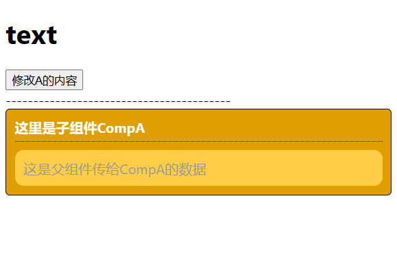

# 前端

## JS ES6

### 数据类型

网上关于 JS 数据类型的说法不一致，我按照 MDN 文档[介绍](https://developer.mozilla.org/zh-CN/docs/Web/JavaScript/Language_Overview#%E6%A6%82%E8%A7%88)和 typeof 的返回值为标准吧。

常规就是八种，

- Number 数字
- String 字符串
- Boolean 布尔
- Symbol 符号
- Object 对象
- Function 函数
- null 空
- undefined 未定义
  分两大类，基本类型和引用类型，引用类型：Object、Function，其余都是基本类型。
  还有说是九种的，加上 bigint。这也是基本类型。
- BigInt 大数
  补充，Object 中又细分了：Array，Date, RegExp。严格上，Function 也是 Object，但是一般还是把函数单独作为一类。

### JS 中的数据类型检测方案

#### 1.typeof

```js
console.log(typeof 1); // number
console.log(typeof true); // boolean
console.log(typeof "mc"); // string
console.log(typeof Symbol()); // symbol
console.log(typeof 1n); // bigint
console.log(typeof null); // object
console.log(typeof undefined); // undefined
console.log(typeof function () {}); // function
console.log(typeof []); // object
console.log(typeof {}); // object
console.log(typeof new Date()); // object
console.log(typeof /d+/); // object
```

优点：能够快速区分基本数据类型

缺点：不能将 Object、Array 和 Null 区分，都返回 object

#### 2.instanceof

```js
console.log(1 instanceof Number); // false
console.log(true instanceof Boolean); // false
console.log("str" instanceof String); // false
console.log(1n instanceof BigInt); // false
console.log(Symbol() instanceof Symbol); // false
console.log([] instanceof Array); // true
console.log(new Date() instanceof Date); // true
console.log(/d+/ instanceof RegExp); // true
console.log(function () {} instanceof Function); // true
console.log({} instanceof Object); // true
```

优点：能够区分 Array、Object 和 Function，适合用于判断自定义的类实例对象

缺点：Number，Boolean，String 基本数据类型不能判断

注，null 和 undefined 会报错`TypeError`，`instanceof`右侧必须是个对象

#### 3.Object.prototype.toString.call()

```js
var toString = Object.prototype.toString;
console.log(toString.call(1));               //[object Number]
console.log(toString.call(true));            //[object Boolean]
console.log(toString.call('mc'));            //[object String]
console.log(toString.call(Symbol());         //[object Symbol]
console.log(toString.call(1n));              //[object BigInt]
console.log(toString.call([]));              //[object Array]
console.log(toString.call({}));              //[object Object]
console.log(toString.call(new Date()));      //[object Date]
console.log(toString.call(/d+/));            //[object RegExp]
console.log(toString.call(function(){}));    //[object Function]
console.log(toString.call(undefined));       //[object Undefined]
console.log(toString.call(null));            //[object Null]
```

优点：精准判断数据类型

缺点：写法繁琐不容易记，推荐进行封装后使用

注，这种方式深究的话，是不可靠的；可以通过定义  [`Symbol.toStringTag`](https://developer.mozilla.org/zh-CN/docs/Web/JavaScript/Reference/Global_Objects/Symbol/toStringTag)  属性来更改  `Object.prototype.toString()`  的行为，从而导致意想不到的结果。但是这种判断类型方式完全够用了，有人会改这个属性？

```js
let myDate = new Date();
myDate[Symbol.toStringTag] = "myDate";
Object.prototype.toString.call(myDate); // '[object myDate]'
myDate instanceof Date; // true
```

[Object.prototype.toString](https://developer.mozilla.org/zh-CN/docs/Web/JavaScript/Reference/Global_Objects/Object/toString#%E7%A4%BA%E4%BE%8B)

#### instanceof 的作用

用于判断一个引用类型是否属于某构造函数；

还可以在继承关系中用来判断一个实例是否属于它的父类型。

#### instanceof 和 typeof 的区别：

typeof 在对值类型 number、string、boolean 、null 、 undefined、 以及引用类型的 function 的反应是精准的；但是，对于对象{ } 、数组[ ] 、null 都会返回 object

为了弥补这一点，instanceof 从原型的角度，来判断某引用属于哪个构造函数，从而判定它的数据类型。

#### 严格判断类型

如果有需要的严格判断类型的要求，可以结合`typeof`和`instanceof`，封装一个自定义方法。参考下面代码。

```js
function type(value) {
  if (value === null) {
    return "null";
  }
  const baseType = typeof value;
  // 基本类型
  if (!["object", "function"].includes(baseType)) {
    return baseType;
  }

  // Symbol.toStringTag 通常指定对象类的“display name”
  // 它在 Object.prototype.toString() 中使用。
  const tag = value[Symbol.toStringTag];
  // 构造函数的名称；例如 `Array`、`GeneratorFunction`、`Number`、`String`、`Boolean` 或 `MyCustomClass`
  const className = value.constructor.name;
  // 当构造函数与 display name 不一致时，以构造函数优先
  if (typeof tag === "string" && tag === className) {
    return tag;
  }

  // 如果它是一个函数，其源代码以 "class" 关键字开头
  if (
    baseType === "function" &&
    Function.prototype.toString.call(value).startsWith("class")
  ) {
    return "class";
  }
  // 输出构造函数
  if (typeof className === "string" && className !== "") {
    return className;
  }
  // 在这一点上，没有合适的方法来获取值的类型，因此我们使用基本实现。
  return baseType;
}
```

可以避免随意通过`Symbol.toStringTag`修改类。但是就不能使用自定义类名了

```js
class C {
  constructor() {
    this.data = "";
  }
  get [Symbol.toStringTag]() {
    return "MClass";
  }
}
var cls = new C();
console.log(type(cls)); // C
console.log(Object.prototype.toString.call(cls)); // [object MClass]
```

### var、let 和 const

var、let、const 都是声明变量的关键词，主要区别是

1. 变量提升，var 声明的变量会出现变量提升的情况，即可以在声明前使用变量；let 和 const 声明前使用会报错；

2. 暂时性死区，var 不存在，let 和 const 存在，在声明语句之前，不能获取和设置变量；

3. 作用域不同，let 和 const 作用于块级作用域，var 作用于函数作用域；

4. 重新赋值，const 声明的是一个常量，值不能改变。let，var 可以；

5. 重复声明，let 和 const 在同一作用域内不能重复声明，var 不限制；

### 作用域、作用域链

**作用域**指变量和函数能够被访问的区域，作用域可分为：

- 全局作用域，在函数和大括号之外声明的变量，都在全局作用域下，可以在程序的任意位置访问；
- 函数作用域，在函数内声明的变量，只能在函数内部访问；
- 块级作用域，在大括号内使用`let`和`const`声明的变量，只存在于块级作用域内，在大括号外不能访问；

**作用域链**：在 JS 中使用变量时，首先 JS 引擎会在当前作用域中寻找该变量，如果没找到，会到其上层作用域寻找，直至变量找到或到了全局作用域。如果在全局作用域内没有找到，会隐式声明该变量（非严格模式下，返回 undefined）或直接报错。

### 闭包

**闭包**指一个函数和对其周围状态的引用捆绑在一起，即闭包让内层函数可以访问到外层函数的作用域。
闭包的使用场景：保存变量（延长变量的生命周期）；保护变量（创建私有化变量）。例子，柯里化函数

### this 对象

this 对象是函数运行时自动生成的一个内部对象，只能在函数内使用。它始终指向调用这个函数的对象。在不同的使用场合下，this 有不同的值，大致可以分为以下 4 种：

- 默认绑定，普通函数调用，this 指向`window`；
- 隐式绑定，函数作为对象的方法被调用，this 指向这个对象；
- new 绑定，作为构造函数调用，new 会返回一个实例对象，this 指向这个实例对象，特殊情况
  - 遇到函数返回一个对象，则 this 指向返回的对象

```js
function fn() {
  this.user = "xxx";
  return {};
}
var a = new fn();
console.log(a.user); //undefined
```

- 返回一个简单类型的数据，则 this 还是指向实例对象

```js
function fn() {
  this.user = "xxx";
  return 1;
}
var a = new fn();
console.log(a.user); //xxx
```

- 显式绑定，使用`call`、`apply`、`bind`可以显式改变函数的 this 指向
- 箭头函数的 this，箭头函数没有自己的 this 指向，它的 this 指向上一级作用域的 this

### call、apply、bind

- 三者都是显式改变函数中的 this 指向。
- 第一个参数就是指向的对象，如果参数为空或是 null、undefined，则默认指向 window
- 都可以传参，但 call 接收的是参数序列，apply 接收数组，而且 call 和 apply 都是一次性传入，bind 可以分多次传入
- bind 是返回绑定 this 之后的函数，而 call 和 apply 是立即执行

#### 实现 bind

IE8 及以下不支持 bind，所以可能会问这个问题

```js
Function.prototype.myBind = function (context) {
  if (typeof this !== "function") {
    throw new TypeError("错误");
  }
  var self = this,
    args = Array.prototype.slice.call(arguments, 1);
  return function Fn() {
    return self.apply(
      this instanceof Fn ? new self([].slice.call(arguments)) : context,
      args.concat([].slice.call(arguments))
    );
  };
};
```

### 原型、原型链

‌ **原型:**   在 JS 中，每当定义一个对象（函数也是对象）时，对象中都会包含一些预定义的属性。其中每个`函数对象`都有一个`prototype`  属性，这个属性指向函数的`原型对象`。
原型对象也可能拥有原型，并从中继承方法和属性，一层一层、以此类推。这种关系常被称为**原型链**。下面总结：

- 每个 class 都有显示原型 prototype
- 每个实例都有隐式原型 `__proto__`
- 实例的 `__proto__` 指向对应 class 的 prototype

### new

1. 首先创建了一个新的空对象
2. 设置原型，将对象的原型设置为函数的 prototype 对象。
3. 让函数的 this 指向这个对象，执行构造函数的代码（为这个新对象添加属性）
4. 判断函数的返回值类型，如果是值类型，返回创建的对象。如果是引用类型，就返回这个引用类型的对象。

#### 实现 new

```js
function mynew(func, ...args) {
  const obj = {};
  obj.__proto__ = func.prototype;
  let result = func.apply(obj, args);
  return result instanceof Object ? result : obj;
}
```

### eventloop 事件循环机制

`JS`是单线程的，为了防止一个函数执行时间过长阻塞后面的代码，所以会先将同步代码压入执行栈中，依次执行，将异步代码推入异步队列，异步队列又分为宏任务队列和微任务队列，因为宏任务队列的执行时间较长，所以微任务队列要优先于宏任务队列。微任务队列的代表就是，`Promise.then`，`MutationObserver`，宏任务的话就是`setImmediate setTimeout setInterval`

JS 运行的环境。一般为浏览器或者 Node。 在浏览器环境中，有 JS 引擎线程和渲染线程，且两个线程互斥。 Node 环境中，只有 JS 线程。 不同环境执行机制有差异，不同任务进入不同 Event Queue 队列。 当主程结束，先执行准备好微任务，然后再执行准备好的宏任务，一个轮询结束。

#### 浏览器中的事件环（Event Loop）

事件环的运行机制是，先会执行栈中的内容，栈中的内容执行后执行微任务，微任务清空后再执行宏任务，先取出一个宏任务，再去执行微任务，然后在取宏任务清微任务这样不停的循环。

- eventLoop 是由 JS 的宿主环境（浏览器）来实现的；

- 事件循环可以简单的描述为以下四个步骤:

  1. 函数入栈，当 Stack 中执行到异步任务的时候，就将他丢给 WebAPIs,接着执行同步任务,直到 Stack 为空；
  2. 此期间 WebAPIs 完成这个事件，把回调函数放入队列中等待执行（微任务放到微任务队列，宏任务放到宏任务队列）
  3. 执行栈为空时，Event Loop 把微任务队列执行清空；
  4. 微任务队列清空后，进入宏任务队列，取队列的第一项任务放入 Stack(栈）中执行，执行完成后，查看微任务队列是否有任务，有的话，清空微任务队列。重复 4，继续从宏任务中取任务执行，执行完成之后，继续清空微任务，如此反复循环，直至清空所有的任务。

  

- 浏览器中的任务源(task):

  - `宏任务(macrotask)`：\
    宿主环境提供的，比如浏览器\
    ajax、setTimeout、setInterval、setTmmediate(只兼容 ie)、script、requestAnimationFrame、messageChannel、UI 渲染、一些浏览器 api
  - `微任务(microtask)`：\
    语言本身提供的，比如 promise.then\
    then、queueMicrotask(基于 then)、mutationObserver(浏览器提供)、messageChannel 、mutationObersve

传送门 ☞ [# 宏任务和微任务](https://juejin.cn/post/7001881781125251086)

#### Node 环境中的事件环（Event Loop)

`Node`是基于 V8 引擎的运行在服务端的`JavaScript`运行环境，在处理高并发、I/O 密集(文件操作、网络操作、数据库操作等)场景有明显的优势。虽然用到也是 V8 引擎，但由于服务目的和环境不同，导致了它的 API 与原生 JS 有些区别，其 Event Loop 还要处理一些 I/O，比如新的网络连接等，所以 Node 的 Event Loop(事件环机制)与浏览器的是不太一样。

 执行顺序如下：

- `timers`: 计时器，执行 setTimeout 和 setInterval 的回调
- `pending callbacks`: 执行延迟到下一个循环迭代的 I/O 回调
- `idle, prepare`: 队列的移动，仅系统内部使用
- `poll轮询`: 检索新的 I/O 事件;执行与 I/O 相关的回调。事实上除了其他几个阶段处理的事情，其他几乎所有的异步都在这个阶段处理。
- `check`: 执行`setImmediate`回调，setImmediate 在这里执行
- `close callbacks`: 执行`close`事件的`callback`，一些关闭的回调函数，如：socket.on('close', ...)

### promise

```js
class Commitment {
  static PENDING = "待定";
  static FULFILLED = "成功";
  static REJECTED = "拒绝";
  constructor(func) {
    this.status = Commitment.PENDING;
    this.result = null;
    this.resolveCallbacks = [];
    this.rejectCallbacks = [];
    try {
      func(this.resolve.bind(this), this.reject.bind(this));
    } catch (error) {
      this.reject(error);
    }
  }
  resolve(result) {
    setTimeout(() => {
      if (this.status === Commitment.PENDING) {
        this.status = Commitment.FULFILLED;
        this.result = result;
        this.resolveCallbacks.forEach((callback) => {
          callback(result);
        });
      }
    });
  }
  reject(result) {
    setTimeout(() => {
      if (this.status === Commitment.PENDING) {
        this.status = Commitment.REJECTED;
        this.result = result;
        this.rejectCallbacks.forEach((callback) => {
          callback(result);
        });
      }
    });
  }
  then(onFULFILLED, onREJECTED) {
    onFULFILLED = typeof onFULFILLED === "function" ? onFULFILLED : () => {};
    onREJECTED = typeof onREJECTED === "function" ? onREJECTED : () => {};
    if (this.status === Commitment.PENDING) {
      this.resolveCallbacks.push(onFULFILLED);
      this.rejectCallbacks.push(onREJECTED);
    }
    if (this.status === Commitment.FULFILLED) {
      setTimeout(() => {
        onFULFILLED(this.result);
      });
    }
    if (this.status === Commitment.REJECTED) {
      setTimeout(() => {
        onREJECTED(this.result);
      });
    }
  }
}
```

### 节流防抖

```js
/**
 * 防抖函数  一个需要频繁触发的函数，在规定时间内，只让最后一次生效，前面的不生效
 * @param fn要被节流的函数
 * @param delay规定的时间
 */
function debounce(fn, delay) {
  //记录上一次的延时器
  var timer = null;
  return function () {
    //清除上一次的演示器
    clearTimeout(timer);
    //重新设置新的延时器
    timer = setTimeout(() => {
      //修正this指向问题
      fn.apply(this);
    }, delay);
  };
}

/**
 * 节流函数 一个函数执行一次后，只有大于设定的执行周期才会执行第二次。有个需要频繁触发的函数，出于优化性能的角度，在规定时间内，只让函数触发的第一次生效，后面的不生效。
 * @param fn要被节流的函数
 * @param delay规定的时间
 */
function throttle(fn, delay) {
  //记录上一次函数触发的时间
  var lastTime = 0;
  return function () {
    //记录当前函数触发的时间
    var nowTime = Date.now();
    if (nowTime - lastTime > delay) {
      //修正this指向问题
      fn.call(this);
      //同步执行结束时间
      lastTime = nowTime;
    }
  };
}
```

### 数组的扩展

1. `...`扩展运算符，可将数组变成逗号分割的参数序列，常用于函数调用

2. 新增两个创建数组的方法：Array.from()将类数组对象和可遍历对象转化为真正的数组，，Array.of()类似 Array 构造函数的功能，但是参数个数不同不会有不同结果

3. 新增的实例对象方法

   1. 遍历：keys, values, entries。这也是对象的遍历方式，因为数组是个特殊的对象，所以能用

   2. 查找：find 返回数组中第一个满足条件的成员, findIndex 返回数组中第一个满足条件的成员的位置，includes 判断是否包含给定值

   3. 修改: copyWithin 在当前数组内部将指定位置的成员复制到其他位置, fill 使用给定值填充一个数组

   4. 转化： flat 展开嵌套的数组，返回一个新数组， flatMap 对数组的每个成员执行一个函数，然后对返回值组成的数组执行 flat 方法，只展开一层

### 对象的扩展

1. 属性简写，可以将变量和函数名直接写在大括号内，作为对象的属性和方法

2. 属性名表达式，在中括号内写表达式，在 es6 中允许在用字面量定义对象时，用表达式的形式表示属性名

3. `...` 对象的扩展运算符，取出参数对象的所有可遍历属性，拷贝到当前对象中，常用于复制对象

4. super 关键词，指向当前对象的原型对象

5. 遍历对象的属性

   1. for...in 遍历自身和继承的的可枚举

   2. keys 自身的可枚举的，不含继承的

   3. getOwnPropertyNames 自身所有属性，含不可枚举的

   4. getOwnPropertySymbols 自身的所有 Symbols 属性的键名

   5. Reflect.ownKeys 自身所有键名（不论 symbols 还是 可枚举），不含继承的

   遍历对象的键名，都遵守同样的属性遍历的次序规则：首先遍历数值键，按照数值升序；其次遍历字符串键，按加入时间升序；最后遍历 symbols 键，按加入时间升序

6. 对象新增的方法：

   1. 遍历：Object.keys, Object.values, Object.entries

   2. 改：Object.assign 合并对象，将源对象合并到目标对象，浅拷贝

   3. 转化：Object.fromEntries entries 的逆操作，将键值对数组转化成对象

   4. Object.is 对比方法，相对于 === ,区别是 is 中，+0 不等于-0，NaN 等于 NaN。=== 相反

   5. Object.setPrototypeOf 设置原型，Object.getPrototypeOf 获取原型。Object.getOwnPropertyDescriptors 获取自身属性描述

## JavaScript

### 数组常用方法

- 数组基本操作有，push\unshift\concat,用于数组添加；pop\shift\slice,用于数组删除；splice 用于修改数组；indexOf 用于查找数组，es6 中增加了 find、includes；

- 用于排序的方法，有 reverse、sort

- 用于数组的转换有 join ，将数组转变为字符串，参数是字符串分割符

- 遍历相关的方法有 some、every、foreach、filter、map、 reduce

方法细节：

push：接收多个参数，并添加到目标数组的末尾，返回数组最新长度

unshift: 接收多个参数，并添加到目标数组的开头，返回数组最新长度

concat: 将目标数组和参数合并到一个数组中，返回一个新数组，**不改变原数组**

pop：删除数组最后一个成员，返回删除的项

shift：删除数组第一项，返回删除的项

slice：获取数组的部分，并将其返回，**不改变原数组**

splice：删除数组的一部分元素，并在删除的位置上添加新的元素。splice(start,0,item),在 start 位置前添加 item ；splice(0,delCount) 删除 delCount 个数组成员，返回被删除的元素。

indexOf: 返回给定元素在数组中第一次出现的位置，如果没有返回 -1，不能找 NaN

find：找到第一个符合条件的数组成员，如果没有返回 undefined，参数是一个回调函数，所有成员依次执行该函数，直到找到第一个返回值为 true 的成员

includes： 判断数组中是否包含给定的一个值，false 和 0 不相等，使用零值相等算法确定是否找到元素

区别：indexOf 不能找 NaN，find，includes 可以

sort：对数组排序，默认按照字典顺序排序

reverse：颠倒数组排序，返回改变后的数组

join：已给定的分隔符，将数组成员连成字符串返回，默认用逗号。undefined、null 和空位都会变换成空字符串

some、every： 判断数组成员是否满足某个条件，some 只要一个成员返回值为 true 则 some 返回 true；every 则需要所有成员返回 true。空数组 some 返回 false ，every 返回 true

forEach，map：对所有成员执行参数函数，forEach 没有返回值，map 有，**不改变原数组**

filter：对所有成员执行参数函数，过滤出返回值为 true 的数组成员，返回一个新数组，**不改变原数组**

## Vue

### MVVM

Model-View-ViewModel 的缩写，Model 表示数据模型，View 表示 UI 组件，ViewModel 表示同步 view 和 model 的对象，数据绑定到 viewmodel 层并且自动渲染到页面中，当视图变化时会通知 viewmodel 更新数据，也就是数据驱动视图。优点：

- 低耦合，view 可以独立于 model 变化，一个 model 可以绑定到多个 view 中；
- 可复用性，可以将一些视图逻辑放在 Model 中，让其他视图复用这部分视图逻辑。

### Vue 数据绑定

#### vue2 数据双向绑定

```js
// 实现 vue2 的数据双向绑定

class Vue {
  constructor(obj_instance) {
    this.$data = obj_instance.data;
    Observer(this.$data);
    Compile(obj_instance.el, this);
  }
}

// 数据劫持 - 监听实例中的数据
function Observer(data_instance) {
  if (!data_instance || typeof data_instance !== "object") return;
  const dependency = new Dependency();
  Object.keys(data_instance).forEach((key) => {
    let value = data_instance[key];
    Observer(value);
    Object.defineProperty(data_instance, key, {
      enumerable: true,
      configurable: true,
      get() {
        // 订阅者加入依赖案例的数组
        Dependency.temp && dependency.addSub(Dependency.temp);
        return value;
      },
      set(newValue) {
        value = newValue;
        Observer(newValue);
        dependency.notify();
      },
    });
  });
}

// HTML 模板解析 - 替换DOM
function Compile(element, vm) {
  vm.$el = document.querySelector(element);
  const fragment = document.createDocumentFragment();
  let child;
  while ((child = vm.$el.firstChild)) {
    fragment.append(child);
  }
  fragment_compile(fragment);
  // 替换 文本内容
  function fragment_compile(node) {
    const pattern = /\{\{\s*(\S+)\s*\}\}/;
    if (node.nodeType === 3) {
      const xxx = node.nodeValue;
      const result_regex = pattern.exec(node.nodeValue);
      if (result_regex) {
        const arr = result_regex[1].split(".");
        const value = arr.reduce((total, current) => total[current], vm.$data);
        node.nodeValue = xxx.replace(pattern, value);
        // 创建订阅者
        new Watcher(vm, result_regex[1], (newValue) => {
          node.nodeValue = xxx.replace(pattern, newValue);
        });
      }
      return;
    }
    if (node.nodeType === 1 && node.nodeName === "INPUT") {
      const attr = Array.from(node.attributes);
      attr.forEach((i) => {
        if (i.nodeName === "v-model") {
          const value = i.nodeValue
            .split(".")
            .reduce((total, current) => total[current], vm.$data);
          node.value = value;
          new Watcher(vm, i.nodeValue, (newValue) => {
            node.value = newValue;
          });
          node.addEventListener("input", (e) => {
            // ['more','like']
            const arr1 = i.nodeValue.split(".");
            // ['more']
            const arr2 = arr1.slice(0, arr1.length - 1);
            // vm.$data.more
            const final = arr2.reduce(
              (total, current) => total[current],
              vm.$data
            );
            final[arr1[arr1.length - 1]] = e.target.value;
          });
        }
      });
    }
    node.childNodes.forEach((child) => {
      fragment_compile(child);
    });
  }
  vm.$el.appendChild(fragment);
}

// 依赖 - 收集和通知订阅者
class Dependency {
  constructor() {
    this.subscribers = [];
  }
  addSub(sub) {
    this.subscribers.push(sub);
  }
  notify() {
    this.subscribers.forEach((sub) => sub.update());
  }
}

// 订阅者
class Watcher {
  constructor(vm, key, callback) {
    this.vm = vm;
    this.key = key;
    this.callback = callback;
    // 临时属性 - 触发 getter
    Dependency.temp = this;
    key.split(".").reduce((total, current) => total[current], vm.$data);
    Dependency.temp = null;
  }
  update() {
    const value = this.key
      .split(".")
      .reduce((total, current) => total[current], this.vm.$data);
    this.callback(value);
  }
}
```

#### vue3 数据绑定

html 代码

```html
<html>
  <body>
    <div id="app">
      <span>阿婆主：{{name}}</span>
      <input type="text" v-model="name" />
      <span>更多：{{more.like}}</span>
      <input type="text" v-model="more.like" />
    </div>
  </body>
  <script src="./vue3数据绑定.js"></script>
  <script>
    const { createApp } = Vue;

    const app = Vue.createApp({
      data() {
        return {
          name: "蛋老师",
          more: {
            like: "一键三连",
          },
        };
      },
    });
    app.mount("#app");
  </script>
</html>
```

绑定代码

```js
/**
 * TODO：
 * 1. 对嵌套对象，依赖会有重复；
 * 2. 目前，对一个状态修改，会造成所有订阅者做update操作
 * 3. 需要用 Vue.createApp 的形式绑定this，之后调用mount，与Vue3原版不同
 */

const Vue = {
  $el: "",
  $data: null,
  createApp: function (obj) {
    this.$data = reactive(obj.data());
    return this;
  },
  mount: function (el) {
    Compile(el, this);
  },
};

// 模板解析，替换DOM
function Compile(element, vm) {
  vm.$el = document.querySelector(element);
  const fragment = document.createDocumentFragment();
  let child;
  while ((child = vm.$el.firstChild)) {
    fragment.append(child);
  }
  fragment_compile(fragment);
  // 替换内容
  function fragment_compile(node) {
    // 正则匹配模板语法，如 {{ name }}
    const pattern = /\{\{\s*(\S+)\s*\}\}/;
    if (node.nodeType === 3) {
      const xxx = node.nodeValue;
      let result = pattern.exec(node.nodeValue);
      if (result) {
        const arr = result[1].split(".");
        const value = arr.reduce((total, current) => total[current], vm.$data);
        node.nodeValue = xxx.replace(pattern, value);
        // 创建订阅者
        new Watcher(vm, result[1], (newValue) => {
          console.log("替换DOM ", newValue);
          node.nodeValue = xxx.replace(pattern, newValue);
        });
      }
      return;
    }
    if (node.nodeType === 1 && node.nodeName === "INPUT") {
      const attr = Array.from(node.attributes);
      attr.forEach((i) => {
        if (i.nodeName === "v-model") {
          const value = i.nodeValue
            .split(".")
            .reduce((total, current) => total[current], vm.$data);
          node.value = value;
          new Watcher(vm, i.nodeValue, (newValue) => {
            node.value = newValue;
          });
          node.addEventListener("input", (e) => {
            // ['more','like']
            const arr1 = i.nodeValue.split(".");
            // ['more']
            const arr2 = arr1.slice(0, arr1.length - 1);
            // vm.$data.more
            const final = arr2.reduce(
              (total, current) => total[current],
              vm.$data
            );
            final[arr1[arr1.length - 1]] = e.target.value;
          });
        }
      });
    }
    node.childNodes.forEach((child) => {
      fragment_compile(child);
    });
  }
  // DOM 回填
  vm.$el.appendChild(fragment);
}

// 依赖，收集并通知订阅者
class Dependency {
  constructor() {
    this.subscribers = [];
  }
  // 收集订阅者
  addSub(sub) {
    this.subscribers.push(sub);
  }
  // 通知订阅者
  notify() {
    this.subscribers.forEach((sub) => {
      sub.update();
    });
  }
}

/**
 * 订阅者
 * 做什么：视图变化时，修改数据模型
 * 什么时候创建：模板解析时，就创建
 *
 */
class Watcher {
  constructor(vm, key, callback) {
    this.vm = vm;
    this.key = key;
    this.callback = callback;
    // 临时属性
    Dependency.temp = this;
    // 触发getter，会执行 Proxy.get
    key.split(".").reduce((total, current) => total[current], vm.$data);
    Dependency.temp = null;
  }
  update() {
    const value = this.key
      .split(".")
      .reduce((total, current) => total[current], this.vm.$data);
    this.callback(value);
  }
}

// // 创建依赖
const dependency = new Dependency();
function reactive(data_obj) {
  if (typeof data_obj !== "object" && data_obj != null) return obj;
  // 代理 数据对象
  return new Proxy(data_obj, {
    get: function (target, propKey, receiver) {
      // 订阅者加入依赖实例的数组中
      Dependency.temp && dependency.addSub(Dependency.temp);
      const value = Reflect.get(target, propKey, receiver);
      // console.log(`获取 ${propKey}---${value}`)
      return typeof value === "object" ? reactive(value) : value;
    },
    set: function (target, propKey, value, receiver) {
      // console.log(`设置 ${propKey}---${JSON.stringify(value)}`);
      // // todo: 并没有指定 propKey，会触发所有订阅者
      const rs = Reflect.set(target, propKey, value, receiver);
      dependency.notify();
      console.dir(dependency);
      return rs;
    },
  });
}
```

### vue2 生命周期

生命周期可以分为 8 个阶段，创建前后、挂载前后，更新前后，卸载前后，以及其他开启和关闭 Keepalive，捕获后代组件的错误，下面是 8 个阶段：

- beforeCreate
- created: 数据监听完成，可获取 data 和 methods
- beforeMount
- mounted ：DOM 渲染完成，可以获取 DOM
- beforeUpdate：数据更新完成，View 层还未更新
- updated：视图层数据已经是最新的
- beforeDestroy：组件的数据和方法都仍有效
- destroyed：组件销毁

#### 组件生命周期

父子组价的生命周期的关系：父组件 beforeCreate -> 父 created -> 父 beforeMount -> 子组件 beforeCreate -> 子 created -> 子 beforeMount -> 子 mounted -> 父 mounted

子组件更新阶段：父 beforeUpdate -> 子 beforeUpdate -> 子 updated -> 父 updated

### computed 和 watch

computed 有缓存机制，当依赖没有变化时，重新调用 computed，不会重新运行，结果会直接从缓存中获取。
watch 主要用来监听特定属性的变化，从而执行回调，进行特定操作。
所以当两者都可以使用的时候，建议使用 computed

### 组件间通信方式

- 父子关系的组件数据传递选择 props 与 $emit 进行传递，也可选择 ref
- 兄弟关系的组件数据传递可选择$bus，其次可以选择$parent 进行传递
- 祖先与后代组件数据传递可选择 attrs 与 listeners 或者 Provide 与 Inject
- 复杂关系的组件数据传递可以通过 vuex 存放共享的变量

父子：props $emit expose/ref attrs v-model
兄弟：mitt eventbBus
跨级：provide、inject
插件：vuex pinia

#### 详情

**props**，父 -> 子，父组件向子组件传入数据。
使用案例，点击按钮，修改子组件中的内容：
父组件 App 代码

```html
<script>
  import CompA from "./CompA.vue";
  export default {
    // 组件选项
    components: {
      CompA,
    },
    // 此处声明一些响应式状态
    data() {
      return {
        msg: "text",
        contentA: "默认数据",
      };
    },
    methods: {
      changeAcontent() {
        setTimeout(() => (this.contentA = "这是父组件传给CompA的数据"), 1000);
      },
    },
  };
</script>

<template>
  <h1>{{msg}}</h1>
  <button @click="changeAcontent">修改A的内容</button>
  <div>-----------------------------------------</div>
  <CompA :content="contentA"></CompA>
</template>
```

子组件 CompA 代码

```html
<template>
  <div class="component">
    <div class="title">{{title}}</div>
    <div class="content">{{content}}</div>
  </div>
</template>

<script>
  export default {
    props: {
      title: {
        type: String,
        default: "这里是子组件CompA",
      },
      content: {
        type: String,
        default: "CompA的内容",
      },
    },
  };
</script>

<style scoped>
  div.component {
    border: 1px solid #000;
    padding: 10px;
    background-color: #e09f00;
    color: white;
    border-radius: 5px;
  }
  .title {
    border-bottom: 1px dotted #000;
    padding-bottom: 5px;
    font-weight: 700;
  }
  .content {
    margin-top: 10px;
    padding: 10px;
    background-color: #ffce46;
    color: #999;
    border-radius: 10px;
  }
</style>
```



### nextTick 机制

在下一轮 DOM 更新循环之后执行延迟回调函数，数据更新后立即使用 nextTick，此时 DOM 是更新之后的。

#### 实现原理

nextTick 接收两个参数，一个是回调函数，另一个是上下文。回调函数会被放在 callbacks 中，也就是异步操作队列。新增回调函数后又执行了 timerFunc 函数，执行异步。timeFunc 的实现由当前运行环境决定，分别由`Promise.then`、`MutationObserver`、`setImmediate`、`setTimeout`。总结：

1. 把回调函数放入 callbacks 等待执行
2. 将执行函数放到微任务或者宏任务中
3. 事件循环到了微任务或者宏任务，执行函数依次执行 callbacks 中的回调

### data 为什么是个函数

一个组件是有多个实例的，这些实例本质上用的都是同一个构造函数，如果 data 是对象的话，修改一个实例中的 data 会影响到其他实例的数据，为确保不冲突，data 必须是个函数。

### v-if 和 v-for

vue2 中，v-for 的优先级大于 v-if，每次渲染都会先循环再判断，带来性能的浪费。
而 vue3 中，v-if 的优先级大于 v-for，if 无法访问到 for 定义域中定义的变量别名，会抛出错误。
总结，v-if 和 v-for 的优先级本身就不明显，加上会造成性能浪费，所以需要将 v-if 和 for 拆开，不能放在同一个节点上。

### keep-alive 的实现

作用：实现组件缓存，保持这些组件的状态，以避免反复渲染导致的性能问题。 需要缓存组件 频繁切换，不需要重复渲染
场景：tabs 标签页 后台导航，vue 性能优化
原理：Vue.js 内部将 DOM 节点抽象成了一个个的 VNode 节点，keep-alive 组件的缓存也是基于 VNode 节点的而不是直接存储 DOM 结构。它将满足条件（pruneCache 与 pruneCache）的组件在 cache 对象中缓存起来，在需要重新渲染的时候再将 vnode 节点从 cache 对象中取出并渲染。

### 插槽 slot

网页结构占位符，分为`默认插槽`、`具名插槽`、`作用域插槽`：

- 默认插槽
- 具名插槽，`slot`上加上`name`属性，标注插槽名。父组件使用时通过`<template v-slot:default>默认插槽</template>`的方式，将具体内容加到子组件的指定位置上。`v-slot:`可简写成`#`
- 作用域插槽

```html
<!--子组件 Child.vue-->
<template>
  <slot name="footer" testProps="子组件的值">
    <h3>没传footer插槽</h3>
  </slot>
</template>

<!--父组件 Parent.vue-->
<child>
  <!-- 把v-slot的值指定为作⽤域上下⽂对象 -->
  <template v-slot:default="slotProps">
    来⾃⼦组件数据：{{slotProps.testProps}}
  </template>
  <template #default="slotProps">
    来⾃⼦组件数据：{{slotProps.testProps}}
  </template>
</child>
```

## 网络

### https 的基本概念

https:是以安全为目标的 HTTP 通道，即 HTTP 下 加入 SSL 层进行加密。

https 协议的作用：建立一个信息安全通道，来确保数据的传输，确保网站的真实性。

### http 和 https 的区别？

- http 是超文本传输协议，信息是明文传输，https 则是具有安全性的 ssl 加密传输协议。
- Https 协议需要 ca 证书，费用较高。
- 使用不同的链接方式，端口也不同，一般，http 协议的端口为 80，https 的端口为 443。
- http 的连接很简单，是无状态的。

> 记忆口诀：明文传输超文本，安全等级各不同。CA 证书费用高，无状连接端难同。

#### https 协议的工作原理


客户端在使用 HTTPS 方式与 Web 服务器通信时有以下几个步骤：

1. 客户端使用 https url 访问服务器，则要求 web 服务器`建立 ssl 链接`。
2. web 服务器接收到客户端的请求之后，会`将网站的证书（证书中包含了公钥），传输给客户端`。
3. 客户端和 web 服务器端开始`协商 SSL 链接的安全等级`，也就是加密等级。
4. 客户端浏览器通过双方协商一致的安全等级，`建立会话密钥`，然后通过网站的公钥来加密会话密钥，并传送给网站。
5. web 服务器`通过自己的私钥解密出会话密钥`。
6. web 服务器`通过会话密钥加密与客户端之间的通信`。

> 记忆口诀：一连二传三协商，四建五得六使用。

#### https 协议的优缺点

- HTTPS 协议要比 http 协议`安全`，可防止数据在传输过程中被窃取、改变，确保数据的完整性。
- https 握手阶段比较`费时`，会使页面加载时间延长 50%，增加 10%~20%的耗电。
- https `缓存`不如 http 高效，会增加数据开销。
- SSL 证书也需要钱，功能越强大的`证书费用`越高。
- SSL 证书需要绑定 `IP`，不能再同一个 ip 上绑定多个域名，ipv4 资源支持不了这种消耗。

### TCP 三次握手


1.  第一次握手：`建立连接时，客户端发送syn包（syn=j）到服务器，并进入SYN_SENT状态，等待服务器确认`；SYN：同步序列编号（Synchronize Sequence Numbers）。
1.  第二次握手：`服务器收到syn包并确认客户的SYN`（ack=j+1），`同时也发送一个自己的SYN包`（syn=k），即 SYN+ACK 包，此时服务器进入 SYN_RECV 状态；
1.  第三次握手：`客户端收到服务器的SYN+ACK包，向服务器发送确认包ACK(ack=k+1）`，此包发送完毕，客户端和服务器进入 ESTABLISHED（TCP 连接成功）状态，完成三次握手。

```
握手过程中传送的包里不包含数据，三次握手完毕后，客户端与服务器才正式开始传送数据。
```

### TCP 四次挥手

1.  `客户端进程发出连接释放报文`，并且停止发送数据。释放数据报文首部，FIN=1，其序列号为 seq=u（等于前面已经传送过来的数据的最后一个字节的序号加 1），此时，客户端进入 FIN-WAIT-1（终止等待 1）状态。 TCP 规定，FIN 报文段即使不携带数据，也要消耗一个序号。

2）`服务器收到连接释放报文，发出确认报文`，ACK=1，ack=u+1，并且带上自己的序列号 seq=v，此时，服务端就进入了 CLOSE-WAIT（关闭等待）状态。TCP 服务器通知高层的应用进程，客户端向服务器的方向就释放了，这时候处于半关闭状态，即客户端已经没有数据要发送了，但是服务器若发送数据，客户端依然要接受。这个状态还要持续一段时间，也就是整个 CLOSE-WAIT 状态持续的时间。

3）客户端收到服务器的确认请求后，此时，客户端就进入 FIN-WAIT-2（终止等待 2）状态，等待服务器发送连接释放报文（在这之前还需要接受服务器发送的最 后的数据）。

4）`服务器将最后的数据发送完毕后，就向客户端发送连接释放报文`，FIN=1，ack=u+1，由于在半关闭状态，服务器很可能又发送了一些数据，假定此时的序列号为 seq=w，此时，服务器就进入了 LAST-ACK（最后确认）状态，等待客户端的确认。

5）`客户端收到服务器的连接释放报文后，必须发出确认`，ACK=1，ack=w+1，而自己的序列号是 seq=u+1，此时，客户端就进入了 TIME-WAIT（时间等待）状态。注意此时 TCP 连接还没有释放，必须经过 2∗∗MSL（最长报文段寿命）的时间后，当客户端撤销相应的 TCB 后，才进入 CLOSED 状态。

6）服务器只要收到了客户端发出的确认，立即进入 CLOSED 状态。同样，撤销 TCB 后，就结束了这次的 TCP 连接。可以看到，服务器结束 TCP 连接的时间要比客户端早一些。

### TCP 和 UDP 的区别

1. TCP 是面向`连接`的，而 UDP 是面向无连接的。

2. TCP 仅支持`单播传输`，UDP 提供了单播，多播，广播的功能。

3. TCP 的三次握手保证了连接的`可靠性`; UDP 是无连接的、不可靠的一种数据传输协议，首先不可靠性体现在无连接上，通信都不需要建立连接，对接收到的数据也不发送确认信号，发送端不知道数据是否会正确接收。

4. UDP 的`头部开销`比 TCP 的更小，数据`传输速率更高`，`实时性更好`。

### DNS 服务

DNS：域名系统，将域名与对应的 IP 进行转换的服务系统；

解析域名的过程如下：

1. 首先搜索浏览器的 DNS 缓存，缓存中维护一张域名与 IP 地址的对应表

2. 若没有命中，则继续搜索操作系统的 DNS 缓存

3. 若仍然没有命中，则操作系统将域名发送至本地域名服务器，本地域名服务器采用递归查询自己的 DNS 缓存，查找成功则返回结果

4. 若本地域名服务器的 DNS 缓存没有命中，则本地域名服务器向上级域名服务器进行迭代查询

   1. 首先本地域名服务器向根域名服务器发起请求，根域名服务器返回顶级域名服务器的地址给本地服务器
   2. 本地域名服务器拿到这个顶级域名服务器的地址后，就向其发起请求，获取权限域名服务器的地址
   3. 本地域名服务器根据权限域名服务器的地址向其发起请求，最终得到该域名对应的 IP 地址
   4. 本地域名服务器将得到的 IP 地址返回给操作系统，同时自己将 IP 地址缓存起来

5. 操作系统将 IP 地址返回给浏览器，同时自己也将 IP 地址缓存起

6. 至此，浏览器就得到了域名对应的 IP 地址，并将 IP 地址缓存起
